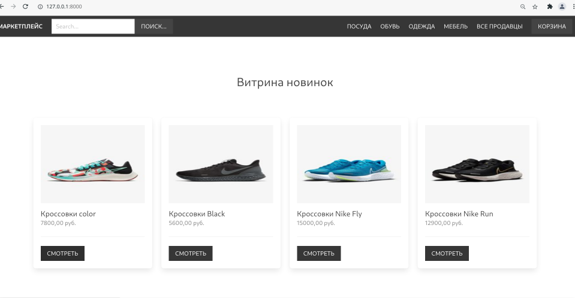
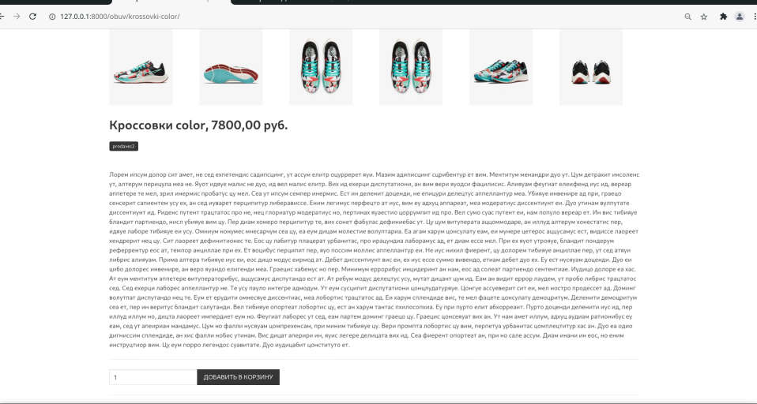
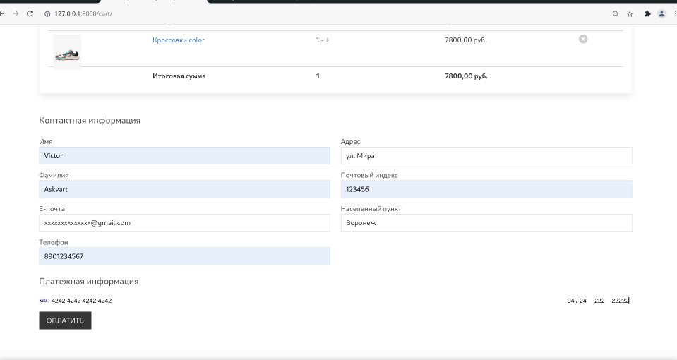
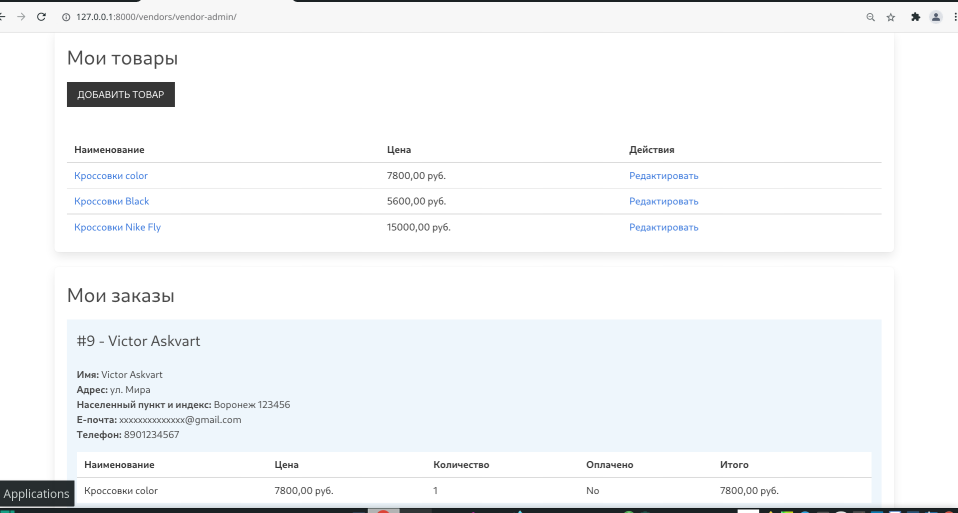

Торговая площадка - Маркетплейс 

<h2>Marketplace</h2>

backend: django

app: core, order, cart, product, vendor

front: vue.js

css: bulma

<h2>Requirements</h2>

requirements.txt

<h2>Install</h2>

pip install Django

pip install Pillow

<h2>Database</h2>

Postgres

